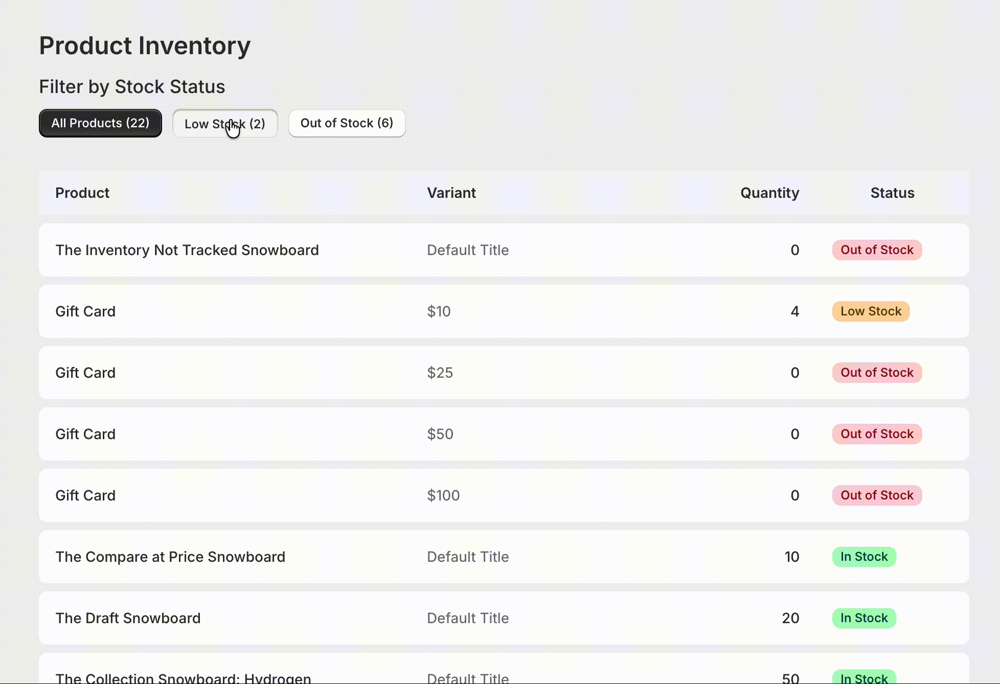

# Shopify Product Inventory Management App

A Shopify app that helps merchants manage their inventory by displaying product stock levels with filtering capabilities for all, low stock and out-of-stock items.

## Demo



*Filter products by stock status and view inventory levels in real-time*

## Quick Start

### Prerequisites

Before you begin, you'll need the following:

1. **Node.js**: [Download and install](https://nodejs.org/en/download/) it if you haven't already.
2. **Shopify Partner Account**: [Create an account](https://partners.shopify.com/signup) if you don't have one.
3. **Test Store**: Set up either a [development store](https://help.shopify.com/en/partners/dashboard/development-stores#create-a-development-store) or a [Shopify Plus sandbox store](https://help.shopify.com/en/partners/dashboard/managing-stores/plus-sandbox-store) for testing your app.

### Setup and start the development server

1. **Clone the repository**
```shell
   git clone https://github.com/karolisdumbrava/notify-low-stock
   cd notify-low-stock
```

2. **Install dependencies and start development**

```shell
shopify app dev
```

### Accessing the app

Once installed, the app will open in your Shopify Admin. You can also find it under **Apps** in your store's admin panel.

## Configuration

### Inventory thresholds

To adjust stock level thresholds, edit app/utils/product.utils.ts:

```
export const INVENTORY_CONFIG = {
  // Products at or below this value are "Out of Stock"
  OUT_OF_STOCK_THRESHOLD: 0,
  
  // Products below this value (but above OUT_OF_STOCK) are "Low Stock"
  LOW_STOCK_THRESHOLD: 5,
} as const;
```